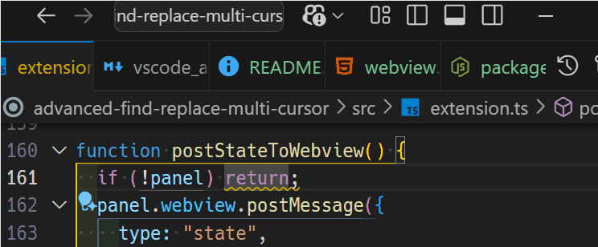

# Bracket & Quote Tools

A VSCode extension to simplify bracket, quote, and tag operations.
It helps streamline selection changes, wrapping, replacement, and deletion of brackets during code editing.
Designed to minimize the number of keybindings that require association.

> For the **Japanese version**, please visit [こちら](https://github.com/wanyakomochimochi/bracketEx/blob/master/README.ja.md)

---

## Main Features

### Change Selection (`changeSelection`)


Automatically selects the range of brackets or tags from the cursor position.
Executing repeatedly expands the selection as follows:

1. Inner content not including the nearest bracket/tag
2. Entire range including the nearest bracket/tag
3. Inner content relative to one outer bracket/tag
4. Entire range including one outer bracket/tag
5. Repeat steps 3 and 4
6. If no outer bracket/tag is found, selection returns to the initial cursor position

Supports multiple cursors.
For HTML files, the selection expands in order: content → whole tag → parent tag content → entire parent tag.

### Replace Brackets or Quotes (`replaceBracketsOrQuotes`)


Replace the nearest opening/closing bracket or quote with any character.
Press Enter without typing anything to **delete** the bracket or quote.
Supports multiple cursors.

### Surround With Input (`surroundWithInput`)



Wrap the selected text with a specified string.
Can freely use HTML tags, brackets, quotes, or any characters.

---

## Supported Languages

- JavaScript / TypeScript
- Python / Ruby
- C / C++ / C# / Java
- HTML / XML

Basic bracket and quote operations work in other languages, but **comments and special syntax may not be correctly recognized**.

---

## Installation

1. Open the Extensions view in VSCode
2. Search for **Bracket & Quote Tools**
3. Click **Install**
   - Alternatively, create a local `.vsix` package and install manually

---

## Usage

Open the Command Palette (`Ctrl+Shift+P` / `Cmd+Shift+P`) and search for:

- extension: Change Selection
- extension: Replace Brackets or Quotes
- extension: Surround With Input

Or set up keyboard shortcuts (see below) for more efficient usage.

---

## Commands

| Command ID                          | Description                                        |
| ----------------------------------- | -------------------------------------------------- |
| `extension.changeSelection`         | Change selection based on cursor and brackets/tags |
| `extension.surroundWithInput`       | Wrap the selection with user input                 |
| `extension.replaceBracketsOrQuotes` | Replace the current bracket or quote with another  |

---

## Example Keyboard Shortcuts

Add the following to `keybindings.json`:

```json
[
  {
    "key": "ctrl+alt+s",
    "command": "extension.changeSelection",
    "when": "editorTextFocus"
  },
  {
    "key": "ctrl+alt+w",
    "command": "extension.surroundWithInput",
    "when": "editorTextFocus"
  },
  {
    "key": "ctrl+alt+r",
    "command": "extension.replaceBracketsOrQuotes",
    "when": "editorTextFocus"
  }
]
```

## Notes

- Complex regular expressions may not be recognized correctly.

- Multi-cursor support is provided, but very deep nesting may cause unexpected behavior.

- Extension behavior may depend on the VSCode version.

## Developer Info

{
"repository": "https://github.com/yourname/bracket-quote-tools",
"license": "MIT",
"vscodeVersion": "1.80+"
}

## Feedback

Bug reports and feature requests are accepted via GitHub Issues.

Your contributions help improve this extension.

_By **wanyako** (Japan)_

---
